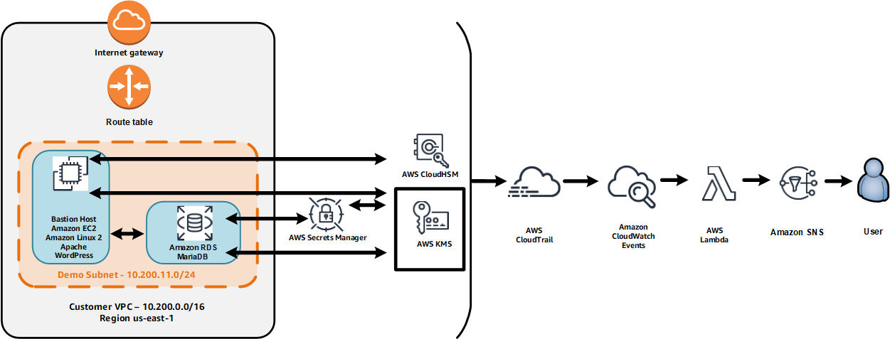
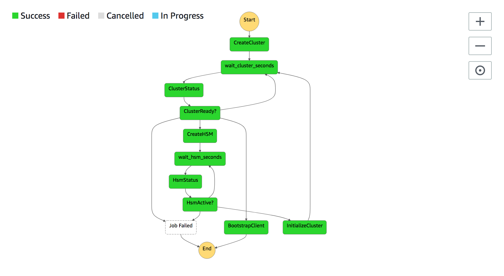

<!--                                                                                       -->
<!-- Copyright 2018 Amazon.com, Inc. or its affiliates. All Rights Reserved.               -->
<!--                                                                                       -->
<!-- Permission is hereby granted, free of charge, to any person obtaining a copy of this  -->
<!-- software and associated documentation files (the "Software"), to deal in the Software -->
<!-- without restriction, including without limitation the rights to use, copy, modify,    -->
<!-- merge, publish, distribute, sublicense, and/or sell copies of the Software, and to    -->
<!-- permit persons to whom the Software is furnished to do so.                            -->
<!--                                                                                       -->
<!-- THE SOFTWARE IS PROVIDED "AS IS", WITHOUT WARRANTY OF ANY KIND, EXPRESS OR IMPLIED,   -->
<!-- INCLUDING BUT NOT LIMITED TO THE WARRANTIES OF MERCHANTABILITY, FITNESS FOR A         -->
<!-- PARTICULAR PURPOSE AND NONINFRINGEMENT. IN NO EVENT SHALL THE AUTHORS OR COPYRIGHT    -->
<!-- HOLDERS BE LIABLE FOR ANY CLAIM, DAMAGES OR OTHER LIABILITY, WHETHER IN AN ACTION     -->
<!-- OF CONTRACT, TORT OR OTHERWISE, ARISING FROM, OUT OF OR IN CONNECTION WITH THE        -->
<!-- SOFTWARE OR THE USE OR OTHER DEALINGS IN THE SOFTWARE.                                -->
<!--                                                                                       -->
# ___AWS re:Invent 2018 SEC353 Keeping Secrets: Securing Your Data with AWS Cryptography___

## Introduction

This repository contains materials that are being used for the AWS 2018 re:Invent chalk talk entitled:

SEC353 Keeping Secrets: Securing Your Data with AWS Cryptography

In this chalk talk we will discuss an architecture that leverages data protection services including AWS CloudHSM, AWS Secrets Manager, and AWS KMS.  Here's a diagram of what we will build.



Here are the main points of the architecture:

- The web server includes is an Amazon Linux2 EC2 instance running Apache and WordPress.
- TLS/SSL offloading is handled via the Apache integration to AWS CloudHSM.
- WordPress is installed on a volume encrypted by AWS KMS.
- The backend database is an Amazon RDS MariaDB instance.
- AWS Secrets Manager is used to rotate the password for the MariaDB database.
- A background process on the Amazon EC2 instance looks for changes in the MariaDB password and updates the WordPress configuration accordingly.
- All CloudTrail API events trigger an AWS Lambda function which uses Amazon SNS to e-mail the event information to SNS topic subscribers.
- The core network and compute infrastructure components are built using AWS CloudFormation.

## Prerequisites

### AWS Account

In order to complete build this architecture you'll need an AWS Account with full administrative access capabilities.

### Region

You will need to build this architecture in regions that offer the services used in the chalk talk including AWS CloudHSM, AWS KMS, AWS Secrets Manager, Amazon EC2, Amazon SNS, and AWS Lambda.
Use the [Region Table](https://aws.amazon.com/about-aws/global-infrastructure/regional-product-services/) to determine which services are available in a Region.
We will use us-east-1 in this documentation.

### Awareness of AWS Services and Networking Technologies

You should be comfortable with:

- AWS console usage
- AWS services including Amazon EC2, Amazon SNS, AWS Step Functions and AWS CloudFormation
- Networking technologies such as DNS
- OpenSSL, TLS/SSL and PKI

### Domain

You will need a DNS domain and the ability to create a a host name "A Record" identified under that domain.
You can use Amazon Route 53 for this if you wish.
In these instructions, we will use the domain *example.com*.

### E-mail address

You will need an e-mail address.
This e-mail address is used to configure WordPress, register a staging TLS/SSL certificate with LetsEncrypt, and to receive CloudTrail API events via Amazon SNS.

### EC2 Instance SSH Key Pair
Please create SSH Key Pair to access WordPress EC2 Instance as this will be required in CloudFormation WordPress stack.

### SSL Certificate Signed by Trusted CA

You can generate a private key and Certificate Signing Request (CSR) and sign it with any of available Trusted CA. The Trusted certificate used in this demo is obtained from LetsEncrypt. 

### Charges

You will incur charges for the services used in these modules.
The pricing for each service is available on that service's pricing page.

The resources built in this chalk talk include (but are not limited to):

- an Amazon EC2 t2.small instance that serves as a bastion host, web server and WordPress host
- an Amazon RDS db.t2.small mySQL instance
- an AWS KMS CMK
- an AWS CloudTrail trail
- an Amazon SNS topic
- an Amazon EC2 Elastic IP address
- an AWS CloudHSM Cluster with single CloudHSM (i.e. $1.60 per hour in us-east-1)

## Security Notes

The purpose of this repository is to provide an illustration of how certain security services can work together.
The templates and procedures in this repository should not be considered as "best practice" implementations.
There are many considerations to take into account when deploying a production web site that have not been taken into account in this repository.

Examples:

- The monitorsecret.sh shell script in the WordPress EC2 instance logs the new database password that came into effect from the rotation of the database secret via AWS Secrets Manager.   Logging such as password is obviously not a good practice.  It was done solely to provide an illustration of how the secret has changed.

- The monitorsecret.sh and mariadb.newway.sh scripts fetch the database password and store it in environment variables.This is not a best practice and was done only for demonstrative purposes.


## Build Procedure

### 1. Get an Elastic IP.

Go to the Amazon EC2 console and get an Elastic IP address in the region you are using.
**Make note of the allocation id.**
You will need the allocation id later in these instructions.

### 2. Set up the "A Record" for your host name to point to your Elastic IP.

For the purpose of this chalk talk, use a low TTL for the "A Record" in case you have to make any changes.
Since our CloudFormation script builds a WordPress site, an example would be the following:

wp.example.com

Assign the Elastic IP address to the "A Record" you created.

### 3. Create an Amazon SNS topic.

Go to the Amazon SNS console and create an SNS topic.
In these instructions we will use the topic aws-keeping-secrets.
**Make note of the ARN (Amazon Resource Name) of the topic.**
You will need the ARN later.
Subscribe your e-mail address to the topic using the "email" type (not "email-json").

### 4. Create a KMS CMK (Customer Master Key).

Go to the Amazon IAM/KMS console and create a CMK (Customer Master Key).
**Make note of the ARN (Amazon Resource Name) of the CMK.**
You will need the ARN later.

### 5. Configure Systems Manager Parameter Store.

| Key | Value |
| ----| ----- |
| keeping-secrets-eip-allocation-id | the allocation ID of your Elastic IP |
| keeping-secrets-cmk-arn | the ARN of your AWS KMS CMK |
| keeping-secrets-topic-arn | the ARN of your AWS SNS topic |

### 6.  Build the CloudFormation VPC stack.

Download the keeping-secrets-vpc-yyyymmdd.yaml file in this repository (where yyyymmdd represents the version date) and run it through CloudFormation.
If you like, specify different values for the fist and second octets of the VPC CIDR block.
The other values just control the naming and tagging of resources.

### 7.  Build the CloudFormation WordPress stack.

Download the keeping-secrets-wp-yyyymmdd.yaml file in this repository (where yyyymmdd represents the version date) and run it through CloudFormation.
There are two sections for parameters.
The first section is for parameters you must update.
The second section is for parameters whose default values are generally acceptable.

| Parameter | Value |
| ----| ----- |
| Stack name | a unique value for the CloudFormation stack |
| E-mail address for CertBot and WordPress | an e-mail address |
| WordPress database name | the name of the WordPress database |
| key pair | select an Amazon EC2 key pair from the dropdown menu |
| fully-qualified domain name | the "A record" you created (e.g. wp.example.com) |

- Note that the e-mail address will be sent to LetsEncrypt and WordPress.  See the web sites for information about their privacy policies.


### 8. Build the Cloudformation CloudHSM stack.
- Download the keeping-secrets-hsm-yyyymmdd.yaml file in this repository (where yyyymmdd represents the version date) and run it through CloudFormation. There is no parameters required for this stack. 
- The necessary inputs will be imported from VPC and WordPress stacks (CloudHSM Cluster's Subnets, WordPress Instance ID and Security Groups). 
- Stack will build multiple Lambda functions orchestrated by AWS Step Functions. Once the stack created successfully, check executionARN value under CloudFormation output tab (i.e. arn:aws:states:REGION:ACCOUNTID:execution:LaunchCloudHSMCluster-XXXXXXXXX:yyyyyyyy-aaaa-bbbb-cccc-zzzzzzzzzzzz). 
- To monitor the progress of CloudHSM creation, please open AWS Step Functions console, click on LaunchCloudHSMCluster-XXXXXXXXX state machine then click on the execution ID which should match the above resource in execution ARN. 
- Under Visual workflow and event history will have full visibility of the current status of CloudHSM cluster creation and initialization. Please note that it will take approximately 17-20min to complete AWS Step Functions successfully.



- In the last step, WordPress EC2 instance will be bootstrapped with CloudHSM Client, Certificate and Cluster Security groups will have ingress rule with Security Groups of WordPress EC2 instance.
- SSH to WordPress instance using SSM Session Manager and run the following commands to ![activate the cluster] (https://docs.aws.amazon.com/cloudhsm/latest/userguide/activate-cluster.html):
```
    $ /opt/cloudhsm/bin/cloudhsm_mgmt_util /opt/cloudhsm/etc/cloudhsm_mgmt_util.cfg
    aws-cloudhsm>enable_e2e
    aws-cloudhsm>listUsers
    aws-cloudhsm>loginHSM PRECO admin password
    aws-cloudhsm>changePswd PRECO admin <NewPassword>
    aws-cloudhsm>quit
```
- Now you have an active CloudHSM Cluster and ready to use. Please check AWS CloudHSM Console to verify the state of the cluster. It might takes couple of minutes to be changed from "Initialized" to "Active" State.

### 9. SSL Offloading
- Browse to **"http://"** followed by the fully-qualified domain name you entered when you built the WordPress CloudFormation stack. You should see the default WordPress site.
- Browse to **"https://"** followed by the fully-qualified domain name you entered when you built the WordPress CloudFormation stack. You should see a warning page because of the the untrusted certificate created by LetsEncrypt Staging.
- Run the following OpenSSL command to check the current staging certificate:
```
$ openssl s_client -connect <YOUR_FQDN>:443
```
- [SSL_Offloading_to_CloudHSM.md](https://github.com/aws-samples/aws-reinvent2018-keeping-secrets/blob/master/SSL_Offloading_to_CloudHSM.md) is step by step guide supported by linux commands to migrated from LetsEncrypt staging/untrusted certificate to Trusted Certificate with Private key stored on AWS CloudHSM.

### 10. Test the environment.

- 10.1 - Browse to "http://" followed by the fully-qualified domain name you entered when you built the WordPress CloudFormation stack.  You should see the default WordPress site.

- 10.2 - Using the Secrets Manager console, select the secret and enable rotation of the secret, set the rotation period to 30 days and choose "Use this secret."  Wait for the rotation to complete.  The default secret name is *wpdemo*.  You should still be able to browse the default WordPress site.

- 10.3 - In the Secrets Manager console, select the secret and click *Rotate Immediately*.  Immediately after you do this, in another tab browse to the web site and click refresh a few times.  You will likely see a "broken database connection message but after several seconds the default WordPress site should appear.  A script on the EC2 server checks Secrets Manager every 10 seconds and updates the WordPress database password setting.

### 11. Clean up

- 11.1 - If you enabled the rotation of the database secret then (1) disable the rotation of the secret and (2) delete the CloudFormation stack with a name referencing the serverless application repository.
- 11.2 - Delete the CloudFormation stack you built from keeping-secrets-hsm.yaml.
- 11.3 - Delete the CloudFormation stack you built from keeping-secrets-wp.yaml.
- 11.4 - Delete the CloudFormation stack you built from keeping-secrets-vpc.yaml.
- 11.5 - Delete any S3 buckets that were created during the launch of the stack.  Note that if you do not delete them, S3 will expire the files 
- 11.6 - Delete any CloudWatch LogGroups that were created that you no longer need.
- 11.7 - **Delete CloudHSM Cluster by deleting HSM within the cluster first then delete the cluster afterward.**
