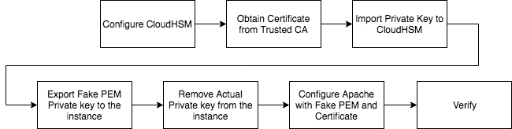

# SSL Offloading to CloudHSM - Step by Step Guide

**SSL Offloading Flowchart**




## Configure CloudHSM

1- Download and install  AWS CloudHSM dynamic engine for OpenSSL for Amazon Linux 2:
```
$ wget https://s3.amazonaws.com/cloudhsmv2-software/CloudHsmClient/EL7/cloudhsm-client-dyn-latest.el7.x86_64.rpm
$ sudo yum install -y ./cloudhsm-client-dyn-latest.el7.x86_64.rpm
```
2- Start the client and CloudHSM Management Utility then enable end-to-end encryption.
```
$ sudo service cloudhsm-client start
$ sudo /opt/cloudhsm/bin/configure -m
$ /opt/cloudhsm/bin/cloudhsm_mgmt_util /opt/cloudhsm/etc/cloudhsm_mgmt_util.cfg
aws-cloudhsm>enable_e2e
```
3- Login to CloudHSM as Crypto Officer using previously configured password (see step#8).
```
aws-cloudhsm>loginHSM CO admin <CO_Password>
```
4- Create new Crypto User and logout from CloudHSM:
```
aws-cloudhsm>createUser CU <username> <password> 
aws-cloudhsm>ListUsers
aws-cloudhsm>logoutHSM
aws-cloudhsm>quit
```
## Obtain Certificate from Trusted CA

5- Download a production Private Key, Certificate and/or Certificate Chain signed by trusted CA and save them in a folder (i.e /home/ec2-user/):
```
$ cp <Prod_Private_Key> /home/ec2-user/privkey.pem
$ cp <Prod_Certificate_Chain> /home/ec2-user/fullchain.pem
```

## Import Private Key to CloudHSM

6- Start Key Management Utility Command line tool:
```
$ /opt/cloudhsm/bin/key_mgmt_util
```
7- Login with Crypto User that created earlier.
```
aws-cloudhsm>loginHSM -u CU -s <CU_username> -p <CU_password>
```

8- Create a symmetric wrapping key that is valid for the current session only.
```
Command: genSymKey -t 31 -s 16 -sess -l wrapping_key_for_import
```
9- Import your existing private key into an HSM.
- importPrivateKey -f <web_server_existing.key> -l <web_server_imported_key> -w <wrapping_key_handle>
```
Command: importPrivateKey -f /home/ec2-user/privkey.pem -l LEReal -w 6
```
## Export Fake PEM Private key to the instance

10- Export the private key in fake PEM format and save locally then exit. This file doesn't contain the actual private key. It contains a reference to the private key that is stored on the HSM. Your web server uses the fake PEM private key file and the AWS CloudHSM dynamic
engine for OpenSSL to offload SSL/TLS processing to an HSM.
- getCaviumPrivKey -k <private_key_handle> -out <web_server_fake_PEM.key>
```
Command: getCaviumPrivKey -k 8 -out /home/ec2-user/privkeyFAKE.pem
Command: exit
```

## Remove Actual Private key from the instance

11- Remove the actual Private key from web server as we no longer need it to be stored on the instance.
```
$ rm /home/ec2-home/privkey.pem
$ ls /home/ec2-user/ | grep .pem
fullchain.pem
privkeyFAKE.pem
```

## Configure Apache with Fake PEM and Certificate

12- Stop httpd service.
```
$ sudo systemctl stop httpd
```
13- Create new conf file for Prod Certificate.
```
$ cp /etc/httpd/conf/httpd-le-ssl.conf /etc/httpd/conf/httpd-hsm-ssl.conf
$ vi /etc/httpd/conf/httpd-hsm-ssl.conf
```
14- Replace the following lines:
```
SSLCertificateFile /etc/letsencrypt/live/<FQDN_Of_WebServer>/fullchain.pem
SSLCertificateKeyFile /etc/letsencrypt/live/<FQDN_Of_WebServer>/privkey.pem
```
with locations of Trusted Certificate and Fake Private Key
```
SLCertificateFile /home/ec2-user/fullchain.pem
SSLCertificateKeyFile /home/ec2-user/privkeyFAKE.pem
```
15- Edit httpd config file with newly created ssl config file then save:
```
$ vi /etc/httpd/conf/httpd.conf
```
Replace
```
Include /etc/httpd/conf/httpd-le-ssl.conf
```
With
```
Include /etc/httpd/conf/httpd-hsm-ssl.conf
```
16- Backup etc/httpd/conf.d/ssl.conf 
```
$ sudo cp /etc/httpd/conf.d/ssl.conf /etc/httpd/conf.d/ssl.conf.backup
```
17- Edit the file with to use CloudHSM OpenSSL Dynamic Engine:
```
$ vi /etc/httpd/conf.d/ssl.conf
```
Replace
```
SSLCryptoDevice uiltin
```
With
```
SSLCryptoDevice cloudhsm
```
18- For Amazon Linux 2, add the below line under the [Service] section in the file /lib/systemd/system/httpd.service: 
```
$ vi /lib/systemd/system/httpd.service
EnvironmentFile=/etc/sysconfig/httpd
```
19- Create /etc/sysconfig/httpd and add n3fips_password as environmental variable.
```
$ touch /etc/sysconfig/httpd
$ vi /etc/sysconfig/httpd
n3fips_password=<CU_user_name>:<password>
```
20- Start httpd service.
```
$ sudo systemctl start httpd
```

# Verify

Browse to **"https://"** followed by the fully-qualified domain name you entered when you built the WordPress CloudFormation stack.
Trusted Certificate now in use with Green Lock (Yes, you made it!)

Run the following command on the WordPress Instance to check client logs with each HTTP/TLS request:
```
$ journalctl -f -u cloudhsm-client
```
Run the following from end user machine and check the output for the certificate:
```
$ openssl s_client -connect wp.aws-keeping-secrets.com:443
```